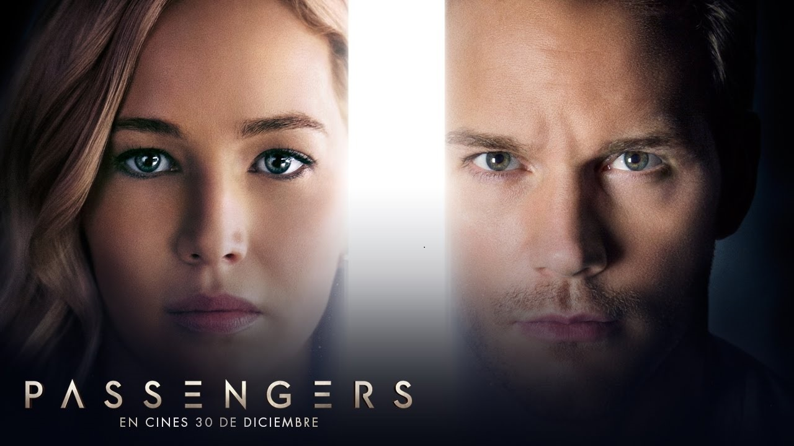

How do people celebrate **Independence Day** here?

In Mexico, on Independence Day, we prepare Mexican food such as Mole, Chiles en Nogada, but my favorite is Pozole. We wear typical clothes from the Mexican Revolution, paint the Mexican flag on our faces, and watch the fireworks.

@[youtube](id|https://youtu.be/Aq4CccUx3-Q)

---
We always have a **big party** on Independence Day

You can hear this song with its amazing rhythm in the movie 'El Infierno' (2010), directed by Luis Estrada.

@[youtube](id|https://youtu.be/vVdWV5WdIWw)

Other amazing Mexican movies:

1. "Amores Perros" (2000)  dirrected by  Alejandro González Iñárritu.
2. "Y Tu Mamá También" (2001) directed by Alfonso Cuarón.
3. "El Laberinto del Fauno" (2006) directed by Guillermo del Toro.
4. "Nosotros los Nobles" (2013) directed by Alazraki.
5. "Roma" (2018) directed by Alfonso Cuarón.
6. "La Ley de Herodes" (1999) directed by Luis Estrada. (Again)
7. "El Crimen del Padre Amaro" (2002) directed by Carlos Carrera.
8. "Temporada de Patos" (2004) directed by Fernando Eimbcke.
9. "Como Agua Para Chocolate" (1992) directed by Alfonso Arau, it's a beautiful film based on the novel with the same name, written by Laura Esquivel.
10. "La dictadura perfecta" (2014) directed by Luis Estrada, una sátira política.

---

On Independence Day it´s a custom to watch fireworks

I didn’t know this song existed, but now thanks to ChatGPT, I discovered it and mixed the country rhythm with the warmth of Mexico. It’s the fusion of two worlds

@[youtube](id|https://youtu.be/VQnHAb_6sOs)

---

I love TV shows from the nineteen nineties

---

Angela is about to leave work and go home 

---

Do you want to join our book club?

---

Her first granddaughter was born in 2017

@[youtube](id|https://youtu.be/9UaJAnnipkY)

@[youtube](id|https://youtu.be/4S_vclBlGZo)

---

They can´t keep putting off the concert like this!

---

Frida decided to take the day off because she really needed a break from work!

---

My friends got off work three hours ago, but I haven´t gotten off work yet

---

- How much money is the car worth?
- How many miles does it have?

---

I´m busy today, so we´re meeting upt on Friday, instead.

---

Rosa decides witch math courses the college should offer because she´s in change of the math departament.

---

Doctors are excited about the discovery. We finally have a new medicne for this illness.

---

When would you like yo meet up?

---

Their menu is really inexpensive on weekdays.

---

I´ve learned not to trust the mirrors in the fitting rooms!

@[youtube](id|https://youtu.be/PivWY9wn5ps)

---

We get a monthly bill, but it´s not very expensive.

---

Ok, Mr. Bear, you need to take a shower! You canpt put it off any longer!

---

Pietro got his new car for a bargain. He paid much less than the regular price. 

---

I went out with him once, and I´ll never do it again!

---

This store is the only sotre where you can buy that.

---

We´re going to meet up in Paris when we´re both there!

@[youtube](id|https://youtu.be/fRNkQH4DVg8)

---

I never have money left after paying my rent and bills.

---

This inexpensive perfumes are *as good as* the rest.

---

She was about to leave when her phone rang

@[youtube](id|https://youtu.be/1gWN0KMrNLI)

---

- Can you get off work this afternoon?

- I´m sorry, but I can´t put off this meeting.

---

During book club, Laura and Max discussed what they liked most about the book they were reading.

---

- I need to learn to relax!
- I know! You´re so stressed all the time!

---

- Who´s in charge of reserving the restaurant?

Alternative

- Who´s in charge of booking the restaurant?

---

I´ll return the shopping cart.

---

My afternoon routine is really important to me.

---

The sandwich was five dollars and the drink was to, so the final amount with tax should be about 8 dollars.

---

- Can´t you schedule your meeting for next week?

- No, they won´t let me put it off.

---

No I didn´t schedule the appointment. I haven´t scheduled it yet because I´m not sure when I´m off. 

---

There are only two T-shirts left on the shelf!

---

You can´t return underwear if you´ve already worn it!

---

Unless it´s raining, let´s meet at the park.

---

I´m not going there unless they have vegetarian dishes. 

---

My coworkers are nice, but they all work to much!

---

- We all **hugged** when he **scored** the final point

- By the way, watch the series Ted Lasso on Apple TV to learn about leadership, motivation, teamwork, positive masculinity, and more

---

- Fred often goes to the gym after work to train for his athletic competitions. 

---

It´s the **championship** game, Bob and Arthur´s team is actually winning!

@[youtube](id|https://youtu.be/d5GkgVhFeZYl)

---

If they all train every day, whay do they play so badly?

---

I **haven´t been** in the gym since high school. I was a **runner**, and I trained all the time.

---

**Look** we all know that we can win this game!

---

I **haven´t seen** Bob since we **saw** him at the championship game last fall.

---

Fred is in a **bad mood** because he lost the championship. 

---

**Eating** grapes is a **common custom** on **New Year´s Eve**

---

- Can Grandma **make it** to come the **Christmas party** ?
- Yes, she´s coming. 

---

Our family **hasn´t had** a **family reunion** since 2020. In 2021 we **had** a video chat instead. 

---

We **have gone** to the annual office party every year since 2010. Over 200 people went last year. 

---

Sorry I couldn´t make it 

---

**No one** in the family **knowns** how the custom **began!**

@[youtube](id|https://youtu.be/NgNm1ADpQO0)

@[youtube](id|https://youtu.be/woS5m96RNzo)

---

---

I´m **in charge** of a **new team** at work, and I´m so busy. 

---

- You´ll never know unless you **try it!**

---

Let´s watch that **new movie** unless you´ve already **seen** it

---

I´m sure I can **make it** to the party for an hour or two.

---

Our annual family reunion is next month

---

I dont want to go on a **cruise** for our honeymoon. I hate traveling by sea!

**Cruise** means a vacation on a ship

@[youtube](id|https://youtu.be/Go7gn6dugu0)

---

- Does the cruise stop at Barcelona ?

---
- Have you ever taken a cruise?
- Yes, we **sailed** to Mexico last year

@[youtube](id|https://youtu.be/ug_bgSWRk_g)

@[youtube](id|https://youtu.be/G6AcBEz3Qxg)

---

- This **luxury** apartment cost so much because it has a pool and a gym.
- **Luxury** means expensive and high-quality

@[youtube](id|https://youtu.be/qMxX-QOV9tI)

---

## The ferry

We **took** the ferry from England to France. 
@[youtube](id|https://youtu.be/Up4WjdabA2c)

---

Let´s take the ferry instead of the bus.

---

The bridge **is closed**, but you can take the ferry

---

If you go **backpacking through** a region you travel around that place with a big bag on you back. 

@[youtube](id|https://youtu.be/K0HSD_i2DvA)

---

If you don´t like driving, consider taking a train. 
  
@[youtube](id|https://youtu.be/-lEPX2fF4Ls)

---

- We want to learn some history on our **trip to Europe**

- If you like history, visit London!

@[youtube](id|https://youtu.be/BGLGzRXY5Bw)

---

When I was young, I went backpacking **through the jungle**

@[youtube](id|https://youtu.be/_7PUPNxsRQ0)

---

A **one-way** ticket lets you travel to a place but you need a different ticket to come back.

@[youtube](id|https://youtu.be/36mCEZzzQ3o)

---

Lorena bought a **one-way** ticket to Los Angeles. 

---

A **round-trip** tickets lets you travel to a place and then **come back**

@[youtube](id|https://youtu.be/HCm6gRHINqA)

---

I bought a **round-trip** ticket, so of course I´m **coming back!**

@[youtube](id|https://youtu.be/-5ecZWwO_hQ)

---

- How much is a **round-trip** flight
- I´d like a ticket to **Chicago** please. 

@[youtube](id|https://youtu.be/1A0MPWseJIE)

---

- I´d like a ticket to **Chicago** please
- **Round-trip** or **one-way**

@[youtube](id|https://youtu.be/CRfy1yorkec)

---

- It can be expensive to fly there in July, but it´s cheaper if you **book** your flight
- It can be expensive to fly there in July, but it´s cheaper if you **reserve** your flight

Both sentences convey the same meaning. You can use either "If you book your flight in advance" or "If you reserve your flight in advance" interchangeably to express the idea that making arrangements for your flight ahead of time will have a positive outcome. There is no significant difference in meaning between the two sentences in this context.

---

She says we can sit **wherever**

@[youtube](id|https://youtu.be/2u6uXuT9pm4)

---

Hector brings the same black backpack and suitcase wherever he travels. 

---

A little dog **followed us** wherever we went. 

You can listen to this song in the movie Guardians of the Galaxy Vol. 3.

@[youtube](id|https://youtu.be/iWOyfLBYtuU)

---

If you arrive late, they´ll make you pay extra. 

---

Can we **agree** that I´m **booking** the hotel next time?

@[youtube](id|https://youtu.be/e9BLw4W5KU8)

---

If it´s **good weather** , we´ll walk to the beach. 

@[youtube](id|https://youtu.be/apBWI6xrbLY)

---

# Maybe and perhaps

**“Maybe”** and **“perhaps”** are both adverbs used to express uncertainty or possibility. They are often used interchangeably, but there are some subtle differences in usage and formality.

1. Maybe:

“Maybe” is more commonly used in informal contexts. It’s straightforward and casual.
Example: “I’ll maybe go to the movies later.”
“Maybe” is often used at the beginning or middle of a sentence.

2. Perhaps:

“Perhaps” is slightly more formal and can be used in both formal and informal contexts, but it’s generally considered a bit more polite.
Example: “Perhaps we should consider another approach.”
“Perhaps” can be used in the middle or at the beginning of a sentence, but it’s more common at the beginning in formal writing.
Both words are used to express uncertainty or possibility, but “perhaps” has a slightly more refined and polite tone, making it a good choice in more professional or academic settings. “Maybe” is more commonly used in everyday conversations.

Usage Examples:

Maybe: "I’m not sure if I’ll be able to make it to the party. Maybe I’ll come a bit later."
Perhaps: “Perhaps it would be best to reschedule the meeting to accommodate everyone’s availability.”

In summary, the choice between “maybe” and “perhaps” often depends on the context and the level of formality you wish to convey. Both words can be used to indicate uncertainty or possibility, but “perhaps” is generally considered slightly more formal and polite.

---
**Passengers** usually **board** a flight thirty minutes before the plane leaves.

**board** means **get on**

It reminds me of a beautiful science fiction and romantic movie called "Passengers"
starring Chris Pratt and Jennifer Lawrence. The movie implies that humans always need company.

You say you want education in English. Well, you know, we all want to change the world, but when you scream at people, I don't think you deserve to teach. Go4More

Instead, Platzi and Duolingo are truly revolutionizing education.

---

There´s a direct flight from here to Boston, You don´t need to fly to New York first.

Direct flight means without stopping.

---

Is this a direct flight to London, or will we have to stop in another city first. 

[DirectFlight.PNG](DirectFlight.PNG "DirectFlight")

---

There used to be direct flights from here to Madrid. 

[Madrid.PNG](Madrid.PNG "Madrid")

---

Did you **get** that?

Once I read that you can use get as a synonym of undestand. Even is more common to use that **understand**. 

The word "get" can be used as a synonym for "understand" in informal speech. For example, you might say "I get what you're saying" or "I don't get it".

The word "get" is more common than "understand" in informal speech because it is shorter and easier to say. It is also more versatile, as it can be used in a wider variety of contexts.

However, the word "understand" is still the more formal and accurate way to say that you comprehend something. So, if you are writing or speaking in a formal setting, it is best to use the word "understand".

Here are some examples of how the word "get" can be used as a synonym for "understand":

- "I finally get what you're saying."
- "I don't get this math problem."
- "Can you help me get this?" (meaning "understand this")
- "I get it now." (meaning "I understand now")

[Get.PNG](Get.PNG "Get")

---

He says the bus has already **departed**

[Departed.PNG](Departed.PNG "Departed")

---

Passengers in Row A to F may board the plane at this time.

[PassengersII.PNG](PassengersII.PNG "PassengersII")

---

I hope we can find a direct flight to Colombia

[Colombia.PNG](Colombia.PNG "Colombia")

---

My flight departes from Lima at non, and it gets to New York at 8 p.m.

---
I
- I´m not sure to get what you´re what you´re saying.

- Sorry, I´ll try to explain what I mean. 

[GetAndTry.PNG](GetAndTry.PNG "GetAndTry")

---

Our flight won´t depart if this strom continues.

---

Sorry, could you repeat that? I didn´t get what you were saying.

[GetII.PNG](GetII.PNG "GetII")

---

You need to show ID when you´re **boarding** the plane.

---

I´m sorry, ma´am but your plane has just **departed**

[DepartedII.PNG](DepartedII.PNG "DepartedII.PNG")

---

When we went **backpacking**, we couldn´t afford nice **hotels**, so we saty in **hostels**

**Hostels** means a **hotel** with shared rooms. 

---

I stayed at some great **hostels** when I went **backpacking**

[Hostels.PNG](Hostels.PNG "Hostels")

---

A **fare** is the money you pay to travel by bus, train, or similar kind of trasportation. 

---

I only had dollars, so I went to the **currency exchange** at the airport and got some euros.

---

Would you mind saying that again?

[Again.PNG](Again.PNG "Again")

<iframe width="560" height="315" src="https://www.youtube.com/embed/eW2qlKa6oHw?si=sdjyyWk6wZvIVHHK" frameborder="0" allowfullscreen></iframe>

---

Mia is **away** this week, an I´m really missing her!

---

He feels sick after riding the bus through the mountains.

[Mountains.PNG](Mountains.PNG "Mountains")

---

Frida has been riding the same bus for nearly fifty years!

[Frida.PNG](Frida.PNG "Frida")

---

Tickets were cheap until they **increased** the **fares**

[Fares.PNG](Fares.PNG "Fares")

---

Do you know if there´s a **hostel** on this street?

[HostelsII.PNG](HostelsII.PNG "HostelsII.PNG")

---

You don´t have a direct flight to Tokio. You have a **layover** in Los Angeles for three hours. 

Meanwhile you can listen to those amazing songs

@[youtube](id|https://youtu.be/YkADj0TPrJA?si=O81SaTScqH9YoM17)

@[youtube](id|https://youtu.be/tl6u2NASUzU?si=H0WbEi7RUkW3ypn8)

---

Luigi is **walking quickly** to get to his next flight because his **layover** is very short. 

---

When you **hitchhike**, you stand by the road and hope that some driver will stop and give you a ride. 

While I was waiting, I was listening to this amazing song. Fortunately, I didn't have to wait for so much time because a truck stopped it.

@[youtube](id|https://youtu.be/K0HSD_i2DvA?si=GUh0kg3Gn0NLODOY)
  
---

We´re not **having much fun** on this vacation!
@[youtube](id|https://youtu.be/1GqhBP2Pp6o?si=05Qnl9uYAWpqiNdT)

---

**Riding** a bike is a cool way to explore Berling.
While I was riding my bike, I was listening to my playlist for training, and this was my first song.

@[youtube](id|https://youtu.be/gWJ8_B9BVxo?si=v5VHt4ZKlLRStZrK)

---

I **hurt** my foot, so I wasn´t able to **explore** much. 

---

The next day, the **temperature fell** thirty **degrees!**

That's wonderful. I love the cold. Remember to always wear warm clothes.

@[youtube](id|https://youtu.be/XatXy6ZhKZw?si=t_As-gjyFcDm1m7o)  

---

We **walked** all day on Monday so the next day my feet were **sore!**

**“Sore”** can be used as a synonym for **“hurt”** in certain contexts, especially when referring to physical discomfort or pain in a specific part of the body.

For example:

- My muscles are sore after the intense workout.
- Her throat is sore because she has a cold.
- I can’t walk properly; my feet are really sore.

However, it’s important to note that **“sore”** is often used to describe a specific type of discomfort, such as the result of muscle strain, injury, or illness, whereas **“hurt”** can have a broader range of meanings and can refer to emotional pain as well.

---

- Would you like to **explore** the city tommorow
- God idea! Let´s walk arount the **old town**

@[youtube](id|https://youtu.be/pl5WHx8QCVk?si=uIS7OUynCkwvNNjE)

---

Dad met Mom when he was **hitchhinking** across the US. 

@[youtube](id|https://youtu.be/c5BL4RNFr58?si=OdWfZLl03YbBBssA)

---

I´m really busy this year, so I´m not **traveling** much. 

---

I **don´t mind** to **layovers** but not for ten hours!

Not even my playlist can save me because I don't have enough battery life. Well, I suppose, meanwhile, I could do sightseeing in Los Angeles. Perhaps I'll find a cafeteria where I could recharge it.

@[youtube](id|https://youtu.be/OmliBRZUxnk?si=6cSexcqnsfwTsYTG)

---

- How can someone dry their hair after getting out of the hotel pool or shower?
- You can dry your hair with a towel, or you can find a hair dryer in your room.

---

- What’s a typical way of paying for a subway or bus ride that doesn’t accept cash?
- In Mexico, you can pay for subway rides and certain bus rides with a card. You can recharge the card using a machine. Simply insert the card into the machine, pay the amount, and your card will be recharged

---

- How do you usually get permission to enter an office building?
- You can usually get permission to enter an office building with an access card, visitor pass, or authorization from the front desk.

---

- How can someone find their way to a popular tourist sight if they’re not familiar with the city?
- You can use a map. You could even use the GPS in your smartphone.

---

- How do you sign in to your work email account?
- You can enter with your credentials, using your username and password.

---

Being early is on time, being on time is late.

---

## About the autor.

 

<a class="badge-base__link LI-simple-link" href="https://mx.linkedin.com/in/fernando-sanchez-mejia?trk=profile-badge">Fernando Sanchez Mejia</a>

